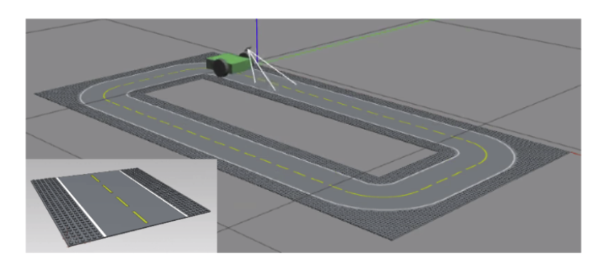

### Robotikseminar

## Contrest result

## Run Test Project
1) In all new terminals 
    - source /opt/ros/foxy/setup.bash
2) cd to jetbot_ws
    - cd Robotikseminar/jetbot_ws
3) Install project structure
    - . install/setup.bash
4) Run simulation in two terminals
    - first termianl (start gazebo): ros2 launch jetbot_ros gazebo_world.launch.py 
    - second termianl (drive robot): ros2 run jetbot_ros teleop_keyboard 

## Compile Project
- colcon build --symlink-install
- colcon build --packages-select my_package

## Build Package
- C++:      ros2 pkg create --build-type ament_cmake --node-name my_node my_package
- ros2 pkg create <pkg-name> --dependencies [deps] --build-type ament_cmake
- Python:   ros2 pkg create --build-type ament_python --node-name my_node my_package
- ros2 pkg create <pkg-name> --dependencies [deps] --build-type ament_python

## Setup Project in every new Terminal
. install/setup.bash

## Use package
ros2 run my_package my_node

## Show topic and service list commands
- ros2 topic list
- ros2 service list

## Add new dependencies i.e. opencv
- go to package.xml file in your package
- add: <depend>opencv2</depend>
- install opencv in terminal with: sudo apt install python3-opencv 

## Add new python script file to your package 
- go to setup.py 
- add in the list of the variable 'package' new strings to your file like 'vision/Primitives' where vision is your package name and Primitives your new created folder

## Install new dependencies in ROS
- rosdep install -i --from-path src --rosdistro foxy -y

## Install packages
- sudo apt install python3-opencv 
- pip install tensorflow-cpu
- sudo apt install python3-imageio

## GIT
# Add new files
- upload single file : git add <path_to_file>
- upload all files: git add .

# Add comment
- git commit -m "<clear text for files>"

# Push files
- git push

# Pull files
- git pull

## useful links
- https://github.com/issaiass/jetbot_diff_drive
- https://docs.ros.org/en/foxy/index.html
- https://www.adafruit.com/product/3777
- https://dev.to/admantium/robot-operating-system-controlling-a-robot-with-the-ros-gazebo-plugins-2jio
- https://index.ros.org/r/common_interfaces/
- https://www.ddcutil.com/i2c_permissions/
